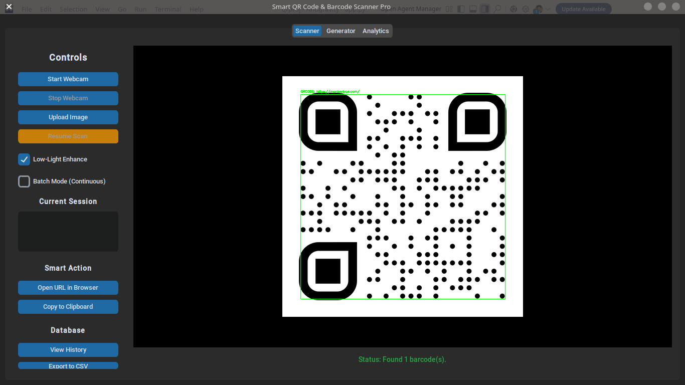
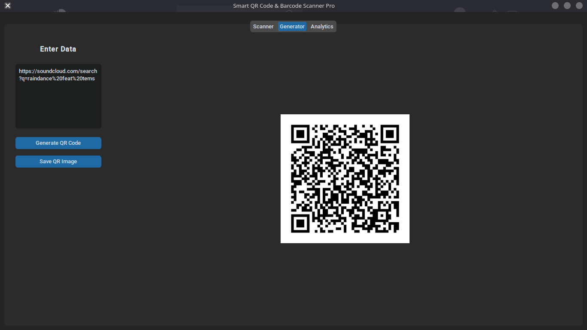
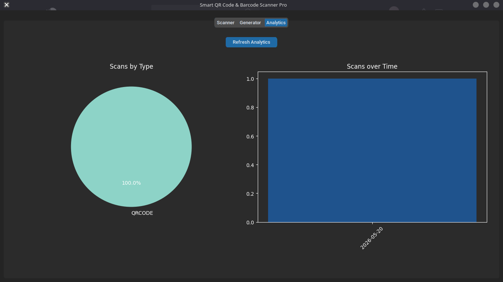
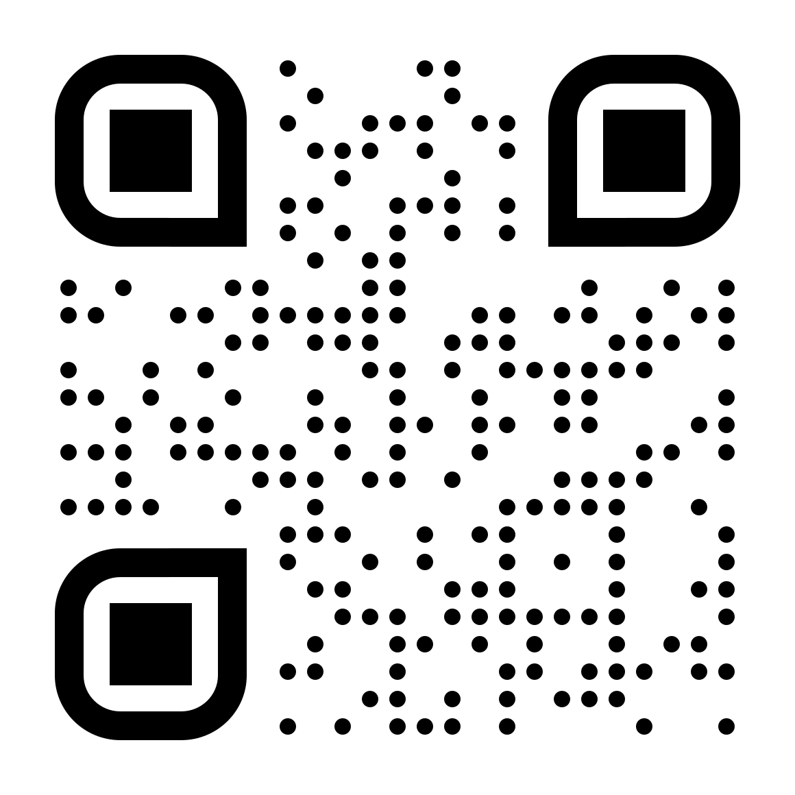

# Smart QR Code & Barcode Scanner System

    

## 📌 Project Overview
The **Smart QR Code & Barcode Scanner System** is an advanced, cross-platform desktop application designed for high-speed, reliable data extraction from barcodes and QR codes. 

Developed with Python, this system leverages Computer Vision (`OpenCV`), highly accurate decoding algorithms (`pyzbar`), and a modern GUI framework (`CustomTkinter`). It is built to handle real-world scanning scenarios, including low-light environments, and features an integrated SQLite database for secure scan history management.

This project is highly suitable for academic presentation, demonstrating practical applications of computer vision, database management, UI/UX design, and industry-standard CI/CD pipelines.

---

## 📸 Screenshots

<div align="center">
  
  
  
</div>

<p align="center">
  <b>Sample QR Code for Testing:</b><br>
  
</p>

---

## 🚀 Key Features

### 1. Intelligent Scanning & Processing
- **Real-Time Webcam Streaming:** High-framerate video processing for instant decoding.
- **Image Upload Support:** Scan static images (PNG, JPG, BMP) directly from the filesystem.
- **Low-Light Enhancement Algorithm:** Utilizes OpenCV contrast-stretching and histogram equalization to decode images in poor lighting conditions.
- **Smart Data Parsing:** Automatically categorizes scanned data into formats like URLs, WiFi Credentials, Emails, Phone Numbers, and Plain Text.

### 2. Continuous Batch Mode Scanning
- **High-Speed Processing:** Enable "Batch Mode" to scan multiple items sequentially without the camera feed pausing.
- **Intelligent Debounce:** An engineered 3-second debounce dictionary prevents the application from spam-saving the exact same barcode multiple times.
- **Live Session History:** A real-time UI feed shows you exactly what was just scanned while you are actively scanning.

### 3. Advanced Analytics Dashboard
- Integrates `matplotlib` directly into the CustomTkinter GUI.
- **Scans by Type:** A dynamic pie chart showing the distribution of scan categories.
- **Scans over Time:** A dynamic bar chart rendering chronological scanning activity.

### 4. Smart Actions Engine
Based on the scanned data type, the application offers context-aware quick actions:
- 🌐 **URL:** Open links directly in the default web browser.
- 📶 **WiFi:** Auto-connect to WiFi networks (Linux `nmcli` integration).
- 📧 **Email:** Open the default mail client with pre-filled addresses.
- 📱 **Phone/Text:** One-click copy to the system clipboard.

### 5. Integrated QR Code Generator
- Generate custom QR codes from any text input.
- Real-time preview of the generated QR code.
- Save generated QR codes locally as high-quality PNG files.

### 6. Data Management & Reporting
- **Local Database:** All successful, unique scans are automatically saved to a local SQLite database (`scans.db`).
- **CSV Export:** Export the entire database to a CSV file for analytics or external record-keeping.

---

## ⚙️ CI/CD Automation (GitHub Actions)
This project utilizes a modern **Continuous Integration / Continuous Deployment (CI/CD)** pipeline via GitHub Actions.

Every time code is pushed to the `main` branch:
1. GitHub spins up a remote Windows Server environment.
2. Installs Python, OpenCV, and all project dependencies.
3. Automatically bundles the entire project into a single, standalone Windows Executable (`.exe`) using **PyInstaller**.
4. Uploads the executable to the GitHub repository.

---

## 📥 How to Run (Compiled Executable - The Easy Way)
You do **not** need to install Python or any dependencies if you just want to use the application!
1. Go to the **"Actions"** tab at the top of this GitHub repository.
2. Click on the latest successful **"Build Windows Executable"** workflow run.
3. Scroll down to the **"Artifacts"** section and download the `Smart-QR-Scanner-Windows.zip` file.
4. Extract the ZIP file and double-click `app.exe` to launch the program immediately on any Windows machine!

---

## 🛠️ How to Run from Source Code (For Developers)

### Prerequisites
The `pyzbar` library relies on the underlying C-library `zbar`.
- **Ubuntu/Debian:** `sudo apt-get install libzbar0`
- **Fedora/RHEL:** `sudo dnf install zbar`

### Environment Setup
1. **Clone/Navigate to the project directory.**
2. **Set up a Virtual Environment (Recommended):**
   ```bash
   python3 -m venv venv
   source venv/bin/activate
   ```
3. **Install Python Dependencies:**
   ```bash
   pip install -r requirements.txt
   ```
4. **Run the Application:**
   ```bash
   python app.py
   ```

---

## 🎓 Demo Flow for Professor/Presentation

If you are demonstrating this project, follow this recommended flow:

1. **Introduction:** Briefly explain the tech stack (Python, OpenCV, SQLite) and emphasize the CI/CD Pipeline automating the `.exe` compilation.
2. **Live Scanning Demo:** 
   - Click **Start Webcam**.
   - Show a QR code to the camera. The system will "beep" and draw a bounding box.
3. **Batch Mode Demo:** 
   - Enable the **Batch Mode** toggle and rapidly scan 2 or 3 different codes to demonstrate the continuous workflow and live session history.
4. **Smart Actions Demo:** 
   - Scan a URL QR code. Click the **Open URL in Browser** button that dynamically appears.
5. **Analytics & Database Demo:** 
   - Open the **Analytics** tab to show the dynamic `matplotlib` pie and bar charts.
   - Click **Export to CSV** to demonstrate report generation.
6. **Edge Case Handling (Low Light):** 
   - Turn on the "Low-Light Enhance" toggle and show how the system pre-processes the image frame to extract codes in dark conditions.
